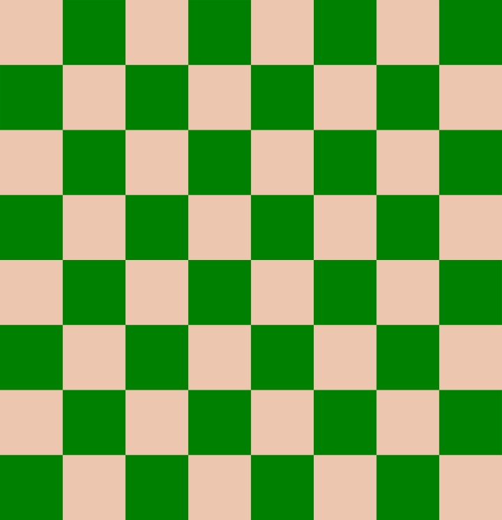
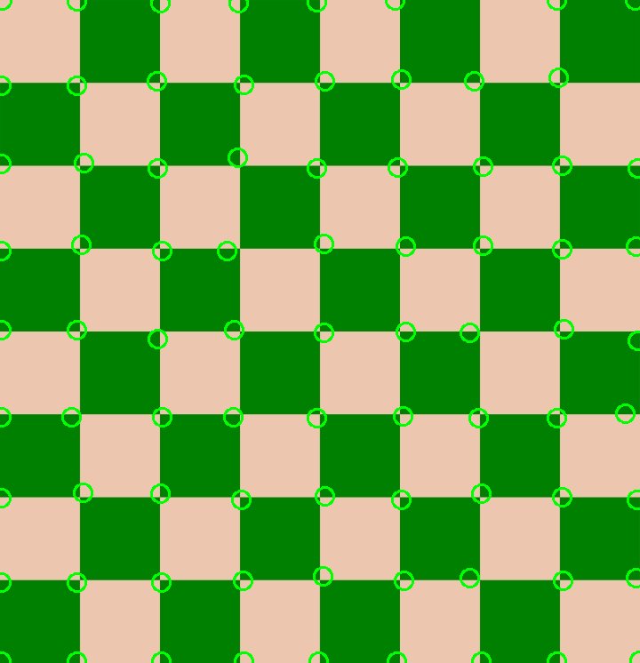

# Task 3
### Team members


| Name                | Sec | BN  |
| ------------------- | --- | --- |
| ezzeldeen Esmail    | 1   | 50  |
| Noran ElShahat      | 2   | 40  |
| Moamen Gamal        | 2   | 11  |
| omar sayed          | 2   | 2   |
| Abdelrahman Almahdy | 1   | 45  |

#  Harris Corner Detection
 
 
|                       **Original**                        |              **Result**               |
| :---------------------------------------------------------------: | :------------------------------------------------------: |
|  |  |


## Gaussian filter 
```cpp
Mat padding(Mat img, int k_width, int k_height)
{
    Mat scr;
    img.convertTo(scr, CV_64FC1);

    int p_rows, p_cols;
    p_rows = (k_height - 1) / 2;
    p_cols = (k_width - 1) / 2;
    // zero padding
    Mat p_image(Size(scr.cols + 2 * p_cols, scr.rows + 2 * p_rows), CV_64FC1, Scalar(0));
    scr.copyTo(p_image(Rect(p_cols, p_rows, scr.cols, scr.rows)));

    return p_image;
}

// func to implement gaussian filter
Mat  Gaussian(Mat scr, int k_w, int k_h, double sigma)
{
    // gaussian kernel
    //w(i,j) = k*(exp((i^2+j^2)/(2*sig))
    int p_rows = (k_h - 1) / 2;
    int p_cols = (k_w - 1) / 2;
    Mat kernel(k_h, k_w, CV_64FC1);
    for (int i = -p_rows; i <= p_rows; i++)
    {
        for (int j = -p_cols; j <= p_cols; j++)
        {
            kernel.at<double>(i + p_rows, j + p_cols) = exp(-(i * i + j * j) / (2.0 * sigma));
        }
    }
    kernel = kernel / sum(kernel);

    Mat p_image = padding(scr, k_w, k_h);

    Mat output = Mat::zeros(scr.size(), CV_64FC1);

    for (int i = 0; i < scr.rows; i++)
    {
        for (int j = 0; j < scr.cols; j++)
        {
            output.at<double>(i, j) = sum(kernel.mul(p_image(Rect(j, i, k_w, k_h)))).val[0];
        }
    }
    //output.convertTo(output, CV_8UC1);
    return output;
}
```
 First we build the Gaussian pyramid of the image in each vector it is applied to Gaussian filter with 
 
 alpha =  segma * k^i	
 
 K= \sqrt{2} 
 
 Segma =1.6 
 
 From vector to vector image is resized by half

```cpp
vector< vector<Mat>> octavepyramid(4);
    double k = sqrt(2);
    double segma = 1.6;
    for (int j = 0; j < 4; j++) {
        for (int i = 0; i < 5; i++) {
            double alpha = pow(k, i) * segma;
            Mat imagenew = Gaussian(img, 5, 5, alpha);
            octavepyramid[j].push_back(imagenew);
        }

        resize(octavepyramid[j][3], img, Size(img.cols / 2, img.rows / 2), INTER_CUBIC);
    }
    
```
 Then we calculate difference of Gaussian DOG from each successive images

```cpp

    vector<vector <Mat>>DOG(4);
        Mat dogImage;
        for (int j = 0; j < 4; j++) {
            for (int i = 0; i < 4; i++) {
                cv::Mat mask;
                cv::subtract(octavepyramid[j][i], octavepyramid[j][i + 1], dogImage, mask, -1);
                //        dogImage = octavepyramid[j][i] - octavepyramid[j][i+1] ;
                DOG[j].push_back(dogImage);
            }
        }
    
```

 Calculate extremas through 3D kernel, if pixel extrema it is written recorded into a bt matrix

```cpp

// kernel to pass over all neighbors detect maxima or minima
    std::vector<double> neig;
    vector<Mat>needed_pt(4);
    for (int k = 0; k < 4; k++)
        for (int z = 1; z < 4; z++) {

            Mat bt = Mat::zeros(octavepyramid[k][z].size(), CV_64FC1);
            for (int i = 1; i < octavepyramid[z][k].rows - 1; i++) {
                for (int j = 1; j < octavepyramid[z][k].cols - 1; j++) {
                    // set as max and min
                    double min, max = octavepyramid[z][k].at<double>(i, j);
                    min = max;
                    // push into array
                    neig.push_back(octavepyramid[k][z].at<double>(i, j - 1));
                    neig.push_back(octavepyramid[k][z].at<double>(i, j + 1));

                    neig.push_back(octavepyramid[k][z].at<double>(i - 1, j - 1));
                    neig.push_back(octavepyramid[k][z].at<double>(i - 1, j));
                    neig.push_back(octavepyramid[k][z].at<double>(i - 1, j + 1));

                    neig.push_back(octavepyramid[k][z].at<double>(i + 1, j - 1));
                    neig.push_back(octavepyramid[k][z].at<double>(i + 1, j));
                    neig.push_back(octavepyramid[k][z].at<double>(i + 1, j + 1));

                    //above image
                    neig.push_back(octavepyramid[k][z - 1].at<double>(i, j));
                    neig.push_back(octavepyramid[k][z - 1].at<double>(i, j - 1));
                    neig.push_back(octavepyramid[k][z - 1].at<double>(i, j + 1));

                    neig.push_back(octavepyramid[k][z - 1].at<double>(i - 1, j - 1));
                    neig.push_back(octavepyramid[k][z - 1].at<double>(i - 1, j));
                    neig.push_back(octavepyramid[k][z - 1].at<double>(i - 1, j + 1));

                    neig.push_back(octavepyramid[k][z - 1].at<double>(i + 1, j - 1));
                    neig.push_back(octavepyramid[k][z - 1].at<double>(i + 1, j));
                    neig.push_back(octavepyramid[k][z - 1].at<double>(i + 1, j + 1));

                    // below image

                    neig.push_back(octavepyramid[k][z + 1].at<double>(i, j));
                    neig.push_back(octavepyramid[k][z + 1].at<double>(i, j - 1));
                    neig.push_back(octavepyramid[k][z + 1].at<double>(i, j + 1));

                    neig.push_back(octavepyramid[k][z + 1].at<double>(i - 1, j - 1));
                    neig.push_back(octavepyramid[k][z + 1].at<double>(i - 1, j));
                    neig.push_back(octavepyramid[k][z + 1].at<double>(i - 1, j + 1));

                    neig.push_back(octavepyramid[k][z + 1].at<double>(i + 1, j - 1));
                    neig.push_back(octavepyramid[k][z + 1].at<double>(i + 1, j));
                    neig.push_back(octavepyramid[k][z + 1].at<double>(i + 1, j + 1));

 float min_pt = neig[0];
                    float max_pt = neig[0];
                    for (int i = 0; i < neig.size(); i++) {

                        if (min_pt > neig[i])
                        {
                            min_pt = neig[i];
                        }
                        else if (max_pt < neig[i])
                        {
                            max_pt = neig[i];
                        }
                    }

                    if (min == min_pt || max == max_pt)
                    {
                        bt.at<double>(i, j) = 255;
                    }

                }
             needed_pt.push_back(bt);
            }
        }

```

Then we remove non significant points of low threshold