# Task 1
### Team members


| Name                | Sec | BN  |
| ------------------- | --- | --- |
| ezzeldeen Esmail    | 1   | 50  |
| Noran ElShahat      | 2   | 40  |
| Moamen Gamal        | 2   | 11  |
| omar sayed          | 2   | 2   |
| Abdelrahman Almahdy | 1   | 45  |

### Questions output and explanation
# Q1: Additive Noise
- This is a sample image i used to work on all noise types
- 
### Uniform Noise
- Uniform noise works by adding a spechific random value in a certain range on all pixels of the image
- 
### Gaussian Noise
- in gaussian noise , we add values to all pixels in the image according to the gaussian normal distribution formula
- 
### Salt-Pepper Noise
- in salt-pepper noise, we add either white or dark pixels randomly to the image pixels
- 

# Q2: Filtering

### Applying the three filters on Uniform Noise image 

  |        Gaussian filter         |          Mean filter           |         Median filter         |
  | :----------------------------: | :----------------------------: | :---------------------------: |
  |  | 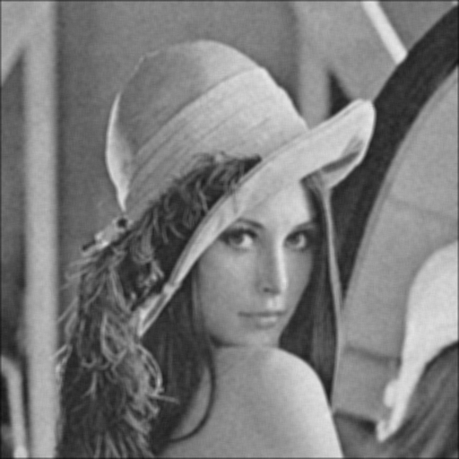 |  |

### Applying the three filters on Gaussian Noise image 

 |       Gaussian filter       |         Mean filter         |       Median filter        |
 | :-------------------------: | :-------------------------: | :------------------------: |
 |  |  | 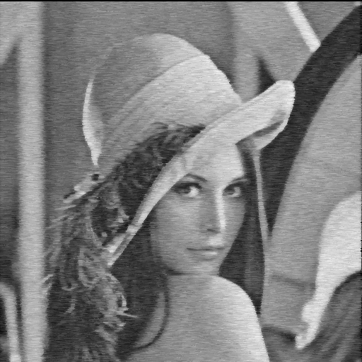 |


### Applying the three filters on salt Noise image 

 |       Gaussian filter       |         Mean filter         |       Median filter        |
 | :-------------------------: | :-------------------------: | :------------------------: |
 |  |  |  |


<!-- ### Gaussian Noise
- in gaussian noise , we add values to all pixels in the image according to the gaussian normal distribution formula
- 
### Salt-Pepper Noise
- in salt-pepper noise, we add either white or dark pixels randomly to the image pixels
-  -->

# Q3:Edge Detection
### Sobel Edge Detection
- apply sobel's kernel in both x and y directions
- add both images together
### Prewitt's Edge Detection
- apply Prewitt's kernel in both x and y directions
- add both images together
### Robert's Edge Detection
- apply Robert's kernel in both x and y directions
- add both images together

### Canny Edge Detection
- Gauessian blur first
- Gradient and slope calculation using sobel 
- Non maximum suppression
- Double thresholding
- Edge tracking by hysteresis

- 

- 
- 
- 

# Q4:Histogram and distribution

- First we needed to make array that contains values of pixels density
- After that we made this array using QTcharts in spline mode 
- we also made Bar mode wihich can be given variable inticates how many values of histogram needs to make one bar
- 
- 

# Q5:Equalization

- Main idea for rqualization is to make all values near each other and remove any big values considereted 
- this is adchieved in code which  can not be the best in all cases that the apply of scale is applied for
- the start to end meaning if there is a case where histo is distributed at 255 means it will
- not be effected other than that it should make wanted output
- 
- 

# Q6: Normalization 
- the main purpose of Normalization is to make the pixel intensities cover my whole range which isn't the case for this image.
- 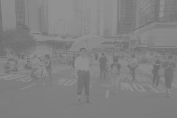
- so in order to solve this problem we need to "rescale" the pixel values to cover my range which in my case is form 0-255 grayscale values
- 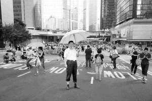

# Q7: Local and Global Threshold 
## Global Threshold
- Thresholding is the simplest method of image segmentation. From a grayscale image, thresholding can be used to create binary images.
- A global thresholding technique makes use of a single threshold value for the whole image.
- Global Threshold has Different Modes as follows:
  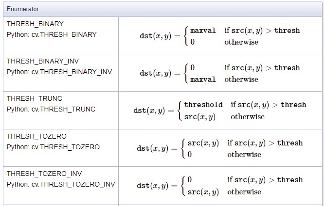

**Original Image**             |
:-------------------------:|
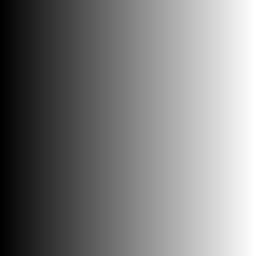  |

|                       **Binary Thershold**                        |              **Inverted Binary Thershold**               |
| :---------------------------------------------------------------: | :------------------------------------------------------: |
| 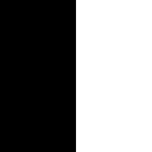 | 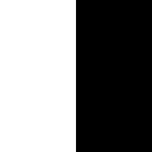 |

**Truncated Thershold**           |
:-------------------------:|
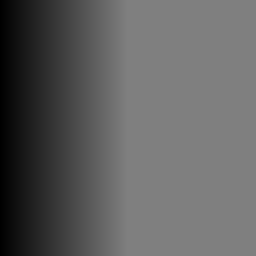  |

|               **Zero Thershold**               |              **Inverted Zero Thershold**               |
| :--------------------------------------------: | :----------------------------------------------------: |
| 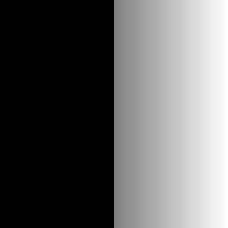 | 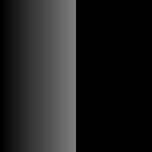 |
  <br />

  ## Local Threshold
- Local adaptive thresholding is used to convert an image consisting of gray scale pixels to just black and white scale pixels. Usually a pixel value of 0 represents white and the value 255.
- Unlike the global thresholding technique, local adaptive thresholding chooses different threshold values for every pixel in the image based on an analysis of its neighboring pixels.
- Local adaptive thresholding has two Modes\
The Mean Mode; Where the threshold value is the mean of neighbourhood area. \
The Gaussian Mode; Where the threshold value is the weighted sum of neighbourhood values where weights are a gaussian window.
- **Original Image**
  <br /> 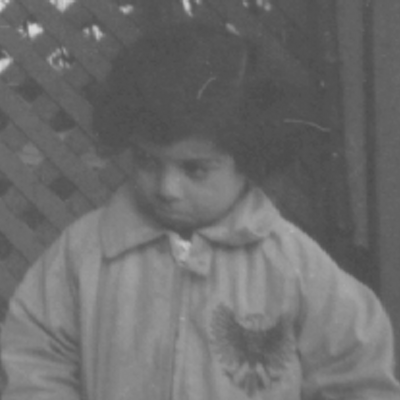
- **Mean Mode**
  <br /> .jpg)
- **Gaussian Mode**
  <br /> .jpg)

# Q8: Histogram RGB 
- As Q4 and Q5 we will make histogram again but this time is RGB so in three layers so we used first split function to split the image to 3 images scaled from 0 to 255 as if it  was gray image then bacme the input for our RGB histogram where used the CCHistogram function again 3 Times and made a refrence to then use in our function by the Mode which was set to 1 in case of RGB and 0 
```c++
{
std::vector <cv::Mat> ImageSplit = Split.Split_Image(ImageColored);
	MisterHisto.RGBHistogram(ImageSplit, 10);
}
```

- one of the things we could have done is to adjust splitting in the function instead of making the input the vector of cv mat of rgb we could split inside the fuction but because we already had split function we used it directly as in vector

- 
- 
- in case of cumilated it was used in a state where there is no scaling meaning it was before equlaization.
- 
- another point in Q8 was gray scaling which is done by only talking any vector of R , G , B splitted if needed but grayscaling as it is , can be applied by using average or weighted in our case we used weighted method
 - 
 - 


# Q9: Lowpass & highpass filtering

- Magnitude image after transfering to frequancy domain


- 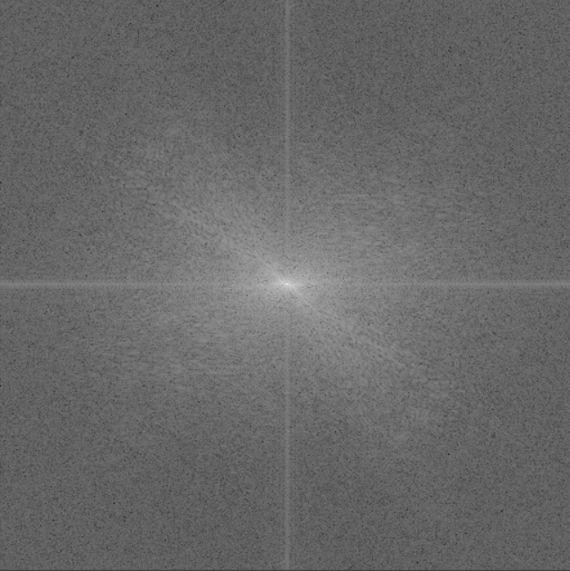 

## Applying lowpass filter

|       Low mask        |          Filtered image         |
| :-------------------------: | :-------------------------: |
| 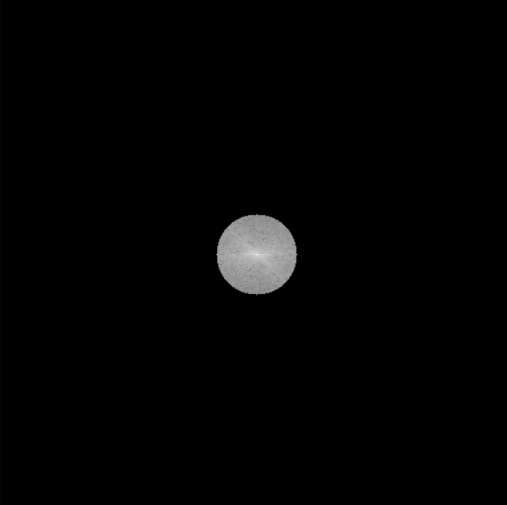 | 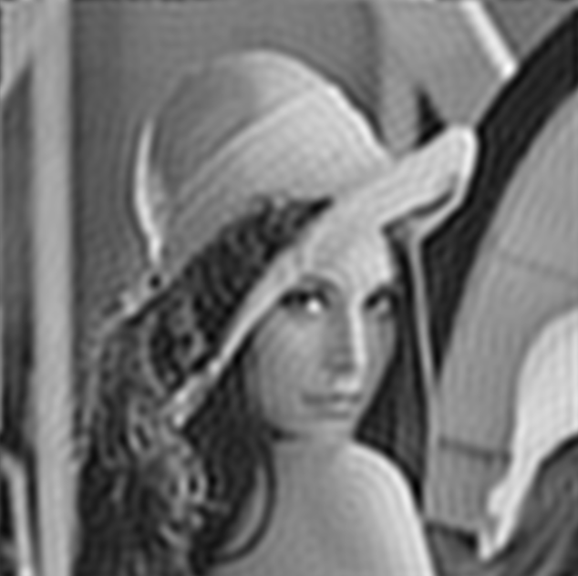 | 


## Applying Highpass filter

|       High mask        |          Filtered image         |
| :-------------------------: | :-------------------------: |
| 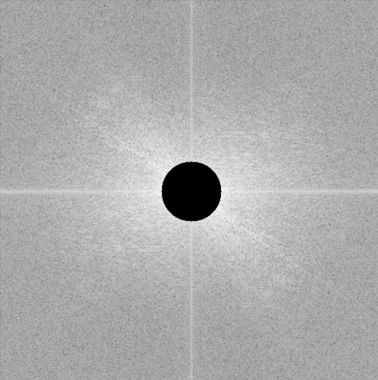 | 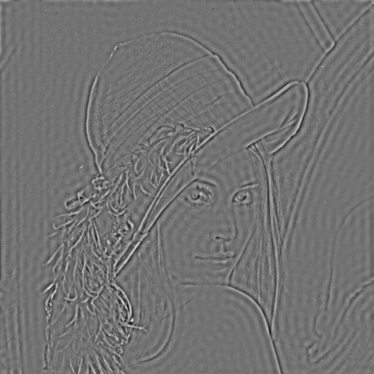 | 

# Q10:Hyprid Images
- For hyprid images we need one image to go though a low pass filter and the other to go through high pass filter

|   low pass | high pass | hyprid |
| 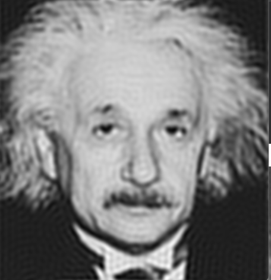 | 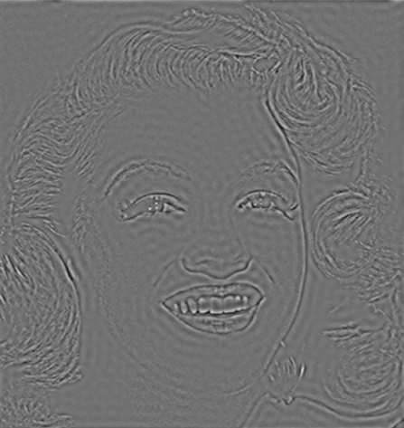 | 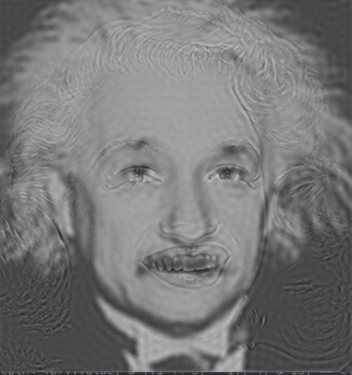
